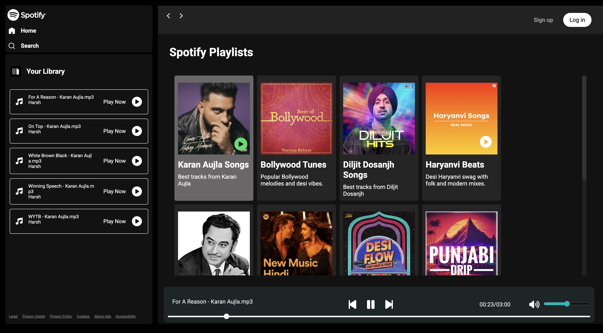
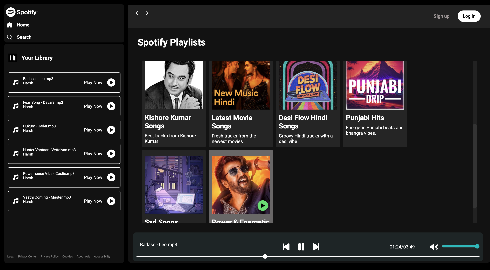

# VibeShelf — Personal Playlist Studio





A simple and elegant Spotify playlist clone built using **HTML**, **CSS**, and **JavaScript**.  
Add your favorite songs and enjoy your personalized music experience.

---

## Features
- Add and manage your favorite songs  
- Play, pause, and switch between tracks  
- Responsive and clean user interface  
- Smooth CSS transitions and animations  

---

## Tech Stack
- **HTML5**  
- **CSS3**  
- **JavaScript (ES6)**  

---

## 📂 Project Structure
SPOTIFY PLAYLIST CLONE/
│
├── css/
│   └── style.css           # Main stylesheet
│
├── images/                 # Icons, album covers, or UI images
│
├── js/
│   └── script.js           # Core JavaScript logic
│
├── songs/                  # Audio files used in the playlist
│
├── .gitignore              # Git ignore configuration
│
└── index.html              # Main HTML file

---

## How to Run
1. Clone this repository  
   ```bash
   git clone https://github.com/<your-username>/vibetune.git

2. Open the folder in your code editor

3. Run index.html in your browser

- No installations or dependencies required.

## Contributing
Contributions are welcome!

- Fork the repo
- Create a branch: git checkout -b feat/my-feature
- Commit your changes: git commit -m "feat: add ..."
- Push: git push origin feat/my-feature
- Open a PR describing your changes

### Please follow the repo’s code style and include tests where appropriate.

## Author

### Harsh Guleria
Student & Developer — building cool web projects and learning every day.
• X: [My X Profile](https://x.com/harsz_06)          
• Email: guleriah59@gmail.com
